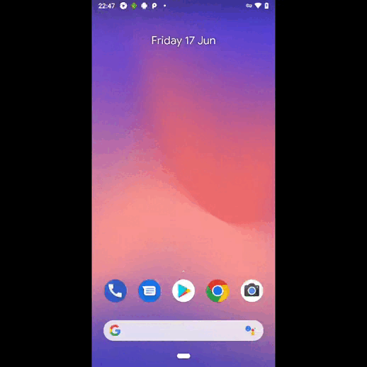

# Автоматизация тестирования мобильных приложений

## :computer: Технологии и инструменты
<p align="center">


</p>


## :arrow_forward: Запуск из терминала
Локальный запуск:
```
gradle clean test -DdeviceHost=(browserstack/local)
```

Удаленный запуск:
```
clean
test
"-DdeviceHost=browserstack"
```

## :film_projector: Видеопример прохождения тестов
> К каждому тесту в отчете прилагается видео. Одно из таких видео представлено ниже.
<p align="center">
  
</p>
